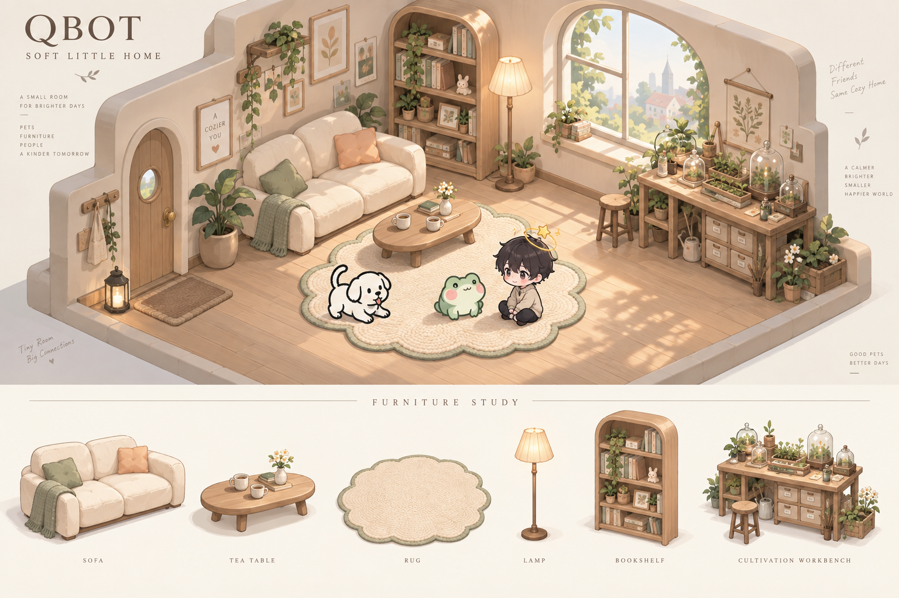

# QBot v0.2：家具生活、培育收藏与顶级配饰

日期：2026-09-10。状态：产品与数值评审稿，附房间美术概念；未修改实际游戏功能。本文替代 v0.1 中“新手合成配饰”“全部确定性合成”“不引入元宝”的决策。未重新完成全经济随机模拟，旧版 5/15/45 日结论作废；以下成本、概率、价格和目标时间均是待验证参数。

## 1. 重新定义追求：先有家，再有收藏，最后有个人标志

| 层级 | 玩家想要的东西 | 主玩法 | 可见结果 |
|---|---|---|---|
| 首日与日常 | 我的房间不再空，能招待朋友 | 种植、订单、制作普通家具 | 灯亮起来，铺好地毯，多一张沙发 |
| 每周 | 房间形成风格，发现意外好东西 | 家具主题抽取、套装搭配、互送灯火 | 漂亮的窗景、会动的家具、来访记录 |
| 数周至数月 | 我的植物种类和育种成果与众不同 | 培育台研究、育苗、词条繁育 | 珍稀植物、专属材料、家族谱系 |
| 顶级 | 角色走到哪里都能被认出来 | 配饰珍藏抽取、珍稀种植材料制作 | 头顶星环、环绕精灵、足下花径 |

新手第一目标改为“亲手做一盏小灯，照亮房间”。不送永久配饰、不用低价花环占据角色头顶。配饰只在图册与房友身上展示；用户主动点击可进入独立试衣预览，试戴不伪装成已拥有。

差异化消费有三个载体：更完整的房间主题、更深的植物与家具收藏、最醒目的角色配饰。人气另有真实社交记录。生成角色的按次费用继续属于工具服务，不能替代这些长期目标。

## 2. 房间美术方案：柔边插画式小屋

概念图：`concepts/soft-little-home-v02.png`。由内置 ImageGen 生成，用于美术方向评审；图中家具不是可直接拖拽的独立游戏资产，示意角色也不是现有角色包的精确复刻。

### 2.1 参考定位

用户所说的 Steam “Low Poly 舒适房间”尚未唯一定位。本轮查到 [Mini Cozy Room: Lo-Fi](https://store.steampowered.com/app/3511030/Mini_Cozy_Room__Lofi/) 和 [Lofi Cozy Room](https://store.steampowered.com/app/4621450/Lofi_Cozy_Room/)。前者官方介绍包括房间装饰、宠物、多人工作空间、便签和专注工具；这里参考其房间作为持续陪伴空间的结构，不宣称它就是用户指定的那款。

本版采用平滑轮廓、插画光影与软质家具。房间的形体可按 2.5D 制作，但呈现不依赖明显多边形切面或像素格。低多边形与像素画是不同美术方法，两种都不作为本版目标风格。

### 2.2 视觉规格

| 项目 | 方向 |
|---|---|
| 结构 | 两面墙的开放小屋，近正交视角，中央为访客与桌宠活动区 |
| 底色 | 暖白、燕麦、浅木；少量鼠尾草绿与杏色，后续可换冷白/月夜皮肤 |
| 形状 | 大圆角、短脚、软垫、圆润灯罩；可爱来自比例和轮廓 |
| 纹理 | 大面积简洁材质，近看才有织物/木纹；避免缩小后形成噪点 |
| 明暗 | 统一软接触阴影，弱高光；不把外来角色强制重绘成同一材质 |
| 留白 | 常用视口约 35% 可走地面，家具不贴满所有空位 |
| 主题拓展 | 奶油木屋、薄荷温室、月光书房；共享尺寸和接口，换颜色与轮廓细节 |

当前概念图展示了线条小狗、柔和 Q 版青蛙和动漫 Q 版人形同处一室的方向。真实兼容性还需拿项目中的黑白表情包、透明视频、深色人形和写实动物各测一轮；不能仅凭概念图宣称适配所有桌宠。

统一脚底接地点、可见角色高度档位和柔影，不统一角色画法。高饱和或复杂角色优先配浅色留白背景。家具提供前后遮挡层；坐卧动作无素材时，使用站在家具旁的回退，不拉伸原角色假装坐下。

### 2.3 首批家具清单与价格带

保留 v0.1 的花纤、精华、花园币作为基础制作资源，星核留给高级装饰和配饰。以下均为永久成品、制作必成；家具功能不提升生产效率。

| 家具 | 获取 | 拟议制作费用 | 给玩家的反馈 |
|---|---|---|---|
| 暖光小台灯 | 教学定向 | 教学 6 花纤 + 60 币 | 首次开灯，有明显房间变化 |
| 圆角茶几 | 常驻配方 | 20 花纤 + 120 币 | 可摆放杯子、花瓶 |
| 云边地毯 | 常驻配方 | 30 花纤 + 180 币 | 房间形成主要活动区 |
| 奶油双人沙发 | 常驻配方 | 60 花纤 + 4 精华 + 360 币 | 重要周目标，适合合影 |
| 弧顶书架 | 常驻配方 | 60 花纤 + 6 精华 + 480 币 | 放收藏物与纪念卡 |
| 植物窗台 | 常驻配方 | 40 花纤 + 4 精华 + 240 币 | 展示自己的花种 |
| 萤火玻璃灯 | 主题池蓝图/保底选取 | 80 花纤 + 12 精华 + 600 币 | 局部轻动态 |
| 月夜大窗景 | 主题池蓝图/保底选取 | 120 花纤 + 20 精华 + 1 星核 + 900 币 | 整间屋的氛围升级 |
| 培育台 | D3 功能解锁，基础外形免费 | 高级外形另制，不升级生产槽 | 显示研究玻璃罩与当前配方 |

普通家具靠稳定种植就能获得，抽取主要承载主题变体、稀有蓝图与珍藏外观。墙、地板、基本照明与功能工作台不能全部被锁进随机池。

普通家具目标约 1–3 个有效参与日一件，沙发/组合角落约一周。这里是原型目标区间，实际同时制作家具、买种苗和育种会改变进度，需以新账本复算。

## 3. 新手与日常目标重排

首次会话仍保留八步，但输出改为家具：选小屋色调 → 种教学花 → 收 8 份 → 交 2 份得 60 币 → 提炼 6 份得 6 花纤 → 做台灯 → 摆进房间并开灯 → 选择茶几或地毯为下个目标。教程闭环净剩为零，另给 600 周转币。

| 阶段 | 主要目标 | 新系统 |
|---|---|---|
| D1 | 台灯与第一张订单 | 房间布置、常驻家具目录 |
| D2 | 第一次家具主题抽取 | 赠一张教学抽取券；结果明确使用独立教学池，不计常规概率 |
| D3 | 培育台完成一次教学研究 | 教学配方五分钟，正常配方恢复数小时 |
| D4–D5 | 种下新花，获得指定精华 | 配方、育苗、种植的三段关系 |
| D5–D7 | 布置会客角，做一次灯火赠礼或本地纪念 | 温暖社交与来访入口 |
| D7 后 | 同时追踪一件家具与一个植物配方 | 双目标；桌面只显示最近可执行行动 |
| D14 后 | 首次正式词条繁育，试用一次传承印记 | 父母词条比较与继承预览 |
| 中后期 | 查看自己喜欢的顶级配饰 | 独立珍藏池、植物专属材料与制作条件 |

每日三种订单继续存在：任意、指定花种、可定向的属性。高价单给“今天种什么”的理由。抽到新蓝图后可一键追踪，订单不会强制要求尚未研究成功的花种。

## 4. 两种货币与两种稀缺

| 资产 | 获取主途径 | 消耗主途径 | 边界 |
|---|---|---|---|
| 花园币 | 种花、订单、日常 | 育苗/种植周转、普通家具工费、普通繁育 | 不无限换元宝或高级研究材料 |
| 元宝 | 充值、限额免费日周投放 | 研究材料、抽取、加速、传承印记 | 同一余额可选用途，不得重复计预算 |
| 灵露 | 元宝商店、限额登录与周奖励 | 永久解锁新植物配方 | 不由普通花园币无限购买 |
| 种源结晶 | 元宝商店、较慢周奖励 | 高阶植物研究 | 与普通种植材料分开 |
| 花纤/三色精华/星核 | 正常花园提炼、订单周奖励 | 家具及顶级配饰制作 | 继续让种植承担生产 |
| 花种专属材料 | 解锁后种植对应花种 | 对应主题配饰与珍藏家具 | 不能只抽到配饰蓝图就跳过这部分 |

元宝试算锚点：¥1 = 10 元宝，充值档先统一比例，不用大额赠送掩盖实际单价。1G 仍只用于基础经济预算；“1 元宝 = 多少 G”不设全局自由兑换，因为研究资格、随机蓝图、等待时间不是同类价值。

元宝必须同时展示免费与付费获得流水。下面的免费额度是持续参与假设，不代表所有人实际都领满；商品页不能声称“免费每天必得”而隐藏任务条件。

## 5. 培育台：看到配方、研究解锁、育苗、种植

### 5.1 四种状态必须在界面分开

发现配方只代表看到了研究条目；投入灵露/种源结晶后开始数小时研究；完成研究获得永久栽培许可；之后反复使用普通材料与花园币育苗，获得种子，最后进入地块种植。

这使第一次解锁承载较高稀缺材料投入，后续使用新物种有稳定成本。不要每一轮种同一种普通新品都重新付一遍永久解锁费。

基础三个物种维持直接买种。进阶物种经育苗产种，一批六颗，避免六块地要点六次独立等待。首版免费提供研究槽 1、育苗/繁育共用生产槽 1，两个槽互不阻塞；功能槽不靠抽奖获得。

### 5.2 第一版配方梯度

| 研究档 | 候选花种 | 灵露 | 种源结晶 | 研究耗时 | 每批六颗育苗耗时 |
|---|---|---:|---:|---:|---:|
| A | 奶油雏菊、铃铛草 | 3 | 0 | 4 小时 | 2 小时 |
| B | 夜光铃兰、玻璃绣球 | 8 | 1 | 8 小时 | 4 小时 |
| C | 月影睡莲、星砂玫瑰 | 16 | 2 | 16 小时 | 8 小时 |
| D | 极光兰、星河昙花 | 32 | 4 | 24 小时 | 12 小时 |

首版可以只制作 A/B 两档，把 C/D 作为后续内容规划；未完成的植物形象和配饰不要提前售卖蓝图。每档需要前一档至少一个已研究配方及首次收获记录。发现条目可通过章节、图鉴、限定库存商店或抽到研究笔记开放；主要路线不能只靠随机发现。

育苗成本并入最终种植成本，不能“育苗收一次完整种苗费、播种再收一次同额”。候选单份产物：基础出售 10 币、全流程成本 6；A/B 出售 11、全流程成本 7；C 出售 12、成本 8；D 出售 13、成本 9。普通出售净差均为 4 币，进阶价值主要来自新属性与专属材料。

高阶订单溢价基于对应基础价，因此仍可能小幅增加币收入，必须计入新模型。更高研究档不同时获得更快生长、更多数量、更多地块和更高利润的多重优势。

### 5.3 专属材料把两条追求接起来

例：研究夜光铃兰 → 育苗与种植 → 提炼时累计“萤光丝”进度 → 用于萤火房灯以及顶级萤火冠冕。首版按对应花种每提炼 24 份得 1 专属材料，余数保存，另有小概率外观变种；配饰材料不靠一次极低掉率卡住。

常规花纤和精华继续同时产出，但专属材料属于额外产出，需单独纳入高阶物种的投放账本。顶级示例配方可先设 400 花纤、120 精华、6 星核、20 萤光丝、3,600 币及对应蓝图；此为起测成本，不承诺当前已能在固定天数内完成。

### 5.4 每日商店与免费投放

| 项目 | 候选价格/数量 | 刷新与作用 |
|---|---|---|
| 灵露 | 20 元宝/个，每日最多 3 | 常驻研究货架，04:00 刷新购买额度 |
| 种源结晶 | 80 元宝/个，每日最多 1 | 同上 |
| 每日研究签到 | 灵露碎片 1，5 碎片合 1 灵露 | 只领一次；不按在线时长重复发 |
| 每周培育目标 | 灵露 2 | 收获/订单/研究累计完成 |
| 双周研究目标 | 种源结晶 1 | 两周一次 |
| 免费元宝 | 每日登录 5 + 完成一张订单 5；每周目标 80 | 满额 28 日共 600 元宝 |

研究货架常驻，不必等随机刷出必需材料；可以另外展示两个随机主题研究条目供发现。每天错过一轮商店不损失配方本身。首个研究教学额外送的灵露单列一次性，不算进持续月供给。

28 日直接免费研究供给约 13.6 灵露（碎片保存产生小数期望口径）和 2 种源结晶。免费 600 元宝若选择花 360 买 18 灵露、160 买 2 结晶、80 抽 4 次家具，则研究总量约 31.6 灵露、4 结晶。该玩家不能同时再把这 600 元宝算成 30 次额外抽取。

## 6. 不确定性：家具主题池与配饰珍藏池

这里设计的是不能兑现金、不能转售提现的虚拟物品抽取。抽取要保留开出意外好东西的体验，同时明确概率、重复处理和可达上限。付费上线前需根据实际发行地区、年龄与平台核验适用规则；本稿没有进行法律适用性判断。

### 6.1 家具主题池

20 元宝或一张对应券一次，候选三档基础概率合计 100%：普通 70%、精良 25%、珍藏 5%。普通结果为小摆件/普通蓝图，精良为主题家具蓝图，珍藏为动态家具/窗景蓝图。具体每档物品等概率或逐项列明权重，上线不能只公开档位概率。

连续 19 次没有珍藏，第 20 次必得珍藏；任意珍藏重置此计数。每累计 40 次形成一个定向周期，第 40 次结果必为用户选定且仍未拥有的本主题珍藏蓝图，并重置珍藏计数；提前得到目标则完成该周期，玩家可开始追下一个。两个保底相遇只发一次结果，不叠两份奖励。

主题变换时，付费抽数保底进度保留；目标变更保留已累积进度，展示新目标所属池。服务端记录主题和目标，不能让用户在结果返回后才选择目标。首版实现时优先采用常驻主题，降低换池规则复杂度。

重复普通、精良、珍藏结果分别给 1/4/12 枚工坊印章。印章只用于该目录补齐普通/精良蓝图，候选兑换费 8/24；不兑换元宝、抽取券、顶级配饰或研究材料。已拥有蓝图不会因重复而增加生产能力。

基础 5% + 第 20 次硬保底下，获得第一件任意珍藏的期望抽数为 (1−0.95^20)/0.05 ≈ 12.83 次；想要某个指定珍藏不能用这个数字估价，指定目标最坏按 40 次计。未计免费券的支出上限为 800 元宝，即候选充值比例下 ¥80；这是最坏边界，不是建议用户必须花的钱。

### 6.2 配饰珍藏池

独立入口，每次 40 元宝或一张珍藏券。用户先选一个当前可获取的顶级配饰蓝图作为目标。每次 2% 直接获得该目标蓝图、18% 得 2 个目标碎片、80% 得 1 个目标碎片，合计 100%。每个目标独立累计 60 次未出则第 60 次直接发目标；抽中或取得后结束该目标计数。

目标碎片 80 个可定向换该蓝图，提前出完整蓝图时碎片保留，可在同系列其他目标间 1:1 使用。蓝图获得后从该账号目标候选中移除，不能重复抽同一张顶级蓝图刷补偿。家具券和配饰券不同，不混淆使用。

每次平均碎片产出为 0.18×2+0.80×1=1.16（直接出蓝图的 2% 路径无碎片）。这一碎片旁路会影响连续抽多个目标的成本，因此不能只根据 2% 声称全部目标长期期望价格。

对无历史碎片、只追第一个目标，忽略碎片提前兑换的保守分析：2% + 第 60 次硬保底，期望约 35.12 次、中位数 35 次、最晚 60 次；纯元宝最多 2,400，即候选比例下 ¥240。碎片旁路只能使获取更早，不会使这个边界更差。每日最多 10 次付费/元宝抽，不能买额外次数突破；免费券同样记保底。

“抽中蓝图”和“已经获得能佩戴的配饰”在结果上必须明确区分。蓝图页面预先展示所需种植材料，抽中后立即给独立试戴预览和制作目标。即使没抽中，目标碎片每次可见增长。

顶级制作材料不进入这个池，以免付费一次同时替代抽取、研究和种植所有环节。初期珍藏池可在中期开放，先赠一张体验券；常态珍藏券发放需单列，例如每周 1 张，不能与家具券混算。

### 6.3 免费抽取与预算

每周家具券 3、珍藏券 1；28 日为 12 次家具、4 次配饰，另有前述免费元宝 600。用户可把元宝偏向研究、家具或配饰。未参与周目标不会自动得到所有券。

建议先给普通家具一个稳定可完成的家，再让抽取承接“主题款/动态款/个人稀有标志”。抽取演出可跳过，不使用假差一点中奖、伪倒计时或购买后暗改概率。所有结果与保底在服务器确定，断线后可恢复。

## 7. 社交：送灯火、被记住、看见自己受欢迎

《光遇》2024 年的官方更新曾加入对玩家创作赠送爱心的方式，覆盖留言、共享空间等，让异步欣赏也能形成连接，见 [官方 Steam 更新公告](https://store.steampowered.com/news/posts/?enddate=1712773171&feed=steam_community_announcements)。这是具体版本的历史参考，不视为当前全部规则。QBot 借鉴“留下有成本的小礼物，对方不在线也能感受到”，不照抄货币名称。

### 7.1 赠礼基本动作

收获一份花 + 5 花园币 → 制成一盏灯火；放在朋友门口/窗台，可附一句手写风格短留言。每日最多送三位，每对关系每天一次；送出后收件人可选择回应，系统不要求等额回礼。

每收到一盏合格灯火，获得 1 暖意点；10 点自动组成 1 颗暖心。每天最多从 10 个不同合格账号获得经济暖意，额外来信仍可阅读。暖心用于友情纪念家具，例如 3 颗小合照架、8 颗双杯茶桌、20 颗朋友留言灯；不换元宝、星核或配饰抽取次数。

重复好友持续送礼会增加这段关系的亲密度；社交收益不等于要求不停扩充陌生人列表。好友礼物来源显示真实人物和日期，不用虚构 NPC 行为伪装真实人气。

### 7.2 关系、流行度和收藏地位分开表达

| 展示 | 算法/来源 | 玩家感受 |
|---|---|---|
| 我和某人的亲密度 | 当日有效赠礼 +2，共同互动 +1，每对每天最多 3 | 有一些人长期记得我 |
| 近 28 日暖访人数 | 主动赠礼/感谢的不同合格账号去重，一人本周期最多计一次 | 有多少人真正喜欢来我这里 |
| 珍藏陈列 | 唯一珍藏家具、配饰与谱系里程碑 | 我的收藏、投入和风格有分量 |

亲密度 3/9/21/45 可解锁双人挥手、击掌、合影边框和纪念动作的候选节点；要有可用素材或标准化动作回退。每天只送礼也能慢慢达到，不因断签扣亲密度。

暖访人数候选门牌阶段 3/10/25/60：微光小屋、常来坐坐、热闹会客厅、星光会客厅。人数窗口滚动会变化，曾达到的纪念徽章永久保留；不要把自然变动包装成需要付费保级。

珍藏陈列可显示稀有来源与获赠故事，避免只用充值金额排一条等级。付费能够更快取得某些珍藏，人气必须来自别人；否则收到一份灯火的情绪价值会被直接购买的数量淹没。

### 7.3 可以商业化的社交外观

节日灯火包装、信纸、一起合影的相框、房间迎宾动作、会客主题套装可以售卖。付费礼物外观使用同样的三次赠送额度、同样的 1 暖意点与人气计数，不通过购买大礼物直接买到十倍好友认可。

设置合格账号的见习进度、赠送速率和账号异常审查；不只依赖 IP/设备，避免误伤同住朋友。新账号礼物可正常显示，经济暖意待资格满足后按规则确认。移除违规计数要可解释；不能靠放任小号把榜单刷高再卖解决方案。

## 8. 加速卡：有明确时间价值的正式道具

| 道具 | 候选元宝价 | 作用 |
|---|---:|---|
| 1 小时加速卡 | 8 | 增加 60 分钟可用加速时长 |
| 4 小时加速卡 | 28 | 增加 240 分钟 |
| 12 小时加速卡 | 72 | 增加 720 分钟 |

加速时长可分次扣用，剩余分钟保留，避免还有 20 分钟却吞掉整张四小时卡。使用前显示目标任务、减少时长、完成后时间和剩余额度。

适用研究、育苗/繁育，以及单块地生长。单任务最多跳过其原始时长的 50%，不因刷新界面重置。花园地块另设全账号每日最多消耗 12 地块小时；一次对六块地各加速一小时会用六小时。

在原基准 0.5 份/地块小时下，这个种植加速上限对应理想连续运转至多多 6 份产物，相对 72 份上限约 8.3%；实际还要有种苗、及时再种，不能把每张卡按完整额外一轮估值。研究的解锁便利价值则取决于缺口与排队，不直接等于种植产出。

初始免费建议：每周两张一小时卡，D3 教学一张单独发放。卡不能补齐灵露、代替研究前置或修改繁育概率。普通玩家界面的“测试立即成熟”改为“使用加速”；开发者立即成熟留在隔离测试存档中，不签发正式经济产物。

## 9. 繁育技能：可选放入的传承印记

首版将用户说的“繁育技能”落成一次性道具“传承印记”，放入一次繁育后消耗。这样价值和使用次数清楚，后续再考虑独立的永久繁育熟练度，避免同名系统混淆。

### 9.1 基础参数

每株三个可遗传槽位：体型、色彩、气质；环境印记单独记录且默认不遗传。每次繁育输出一颗子代种子，按当前设定父母各消耗一次繁育资格，亲本实体不删除。

| 某槽位的父母情况 | 不使用印记 | 使用印记 |
|---|---:|---:|
| 仅一方有可遗传词条 | 50% 继承 | 75% 继承 |
| 双方都有相同词条 | 75% 继承 | 90% 继承 |
| 双方都有不同且互斥词条 | 先各 50% 选候选，再以 50% 继承 | 先各 50% 选候选，再以 75% 继承 |

最后一行意味着每个具体候选的最终概率从 25% 提高到 37.5%，不是双方都变成 75%。界面应显示具体词条的最终概率，而不是只放一个“继承率提升”大字。

各槽独立判定。候选为空不随机新增；之后可对未继承的空槽以 5% 做一次自然变异判定，印记不提高该概率。变异池各词条概率需另表公开，不覆盖已经成功继承的词条。

如果父母在三个槽都有同样词条，不用道具三词条全继承率为 0.75³=42.19%，使用后为 0.90³=72.90%。若三个词条各只有一个亲本提供，则从 0.50³=12.50% 提升到 0.75³=42.19%。这是道具能直观看到的价值。

### 9.2 道具获取与使用

候选价格 20 元宝，每日最多 2 个；每周繁育目标免费 1 个，首次学习送 1 个。每日限制共享所有购买入口，礼包不可绕过。暂不叠加第二个印记，不设失败返还后继续自动购买。

选择双方亲本 → 展示各槽结果概率 → 可选放入印记 → 确认扣材料及资格 → 等待四小时 → 收到子代与谱系卡。加速可减少等待，但结果在服务端开始任务时确定并保存，避免收取前改时间/回档重掷。

蓝图解锁、父母词条组合、选择是否放印记、等待揭晓构成策略与随机性。用户能决定风险投入，系统不将失败成本隐藏在完成按钮后。

## 10. 新版收支影响：哪些旧数字还能用

保留标准基准 72 份日产、24 份订单、36 份提炼。若每天送三盏灯火，另 3 份用于赠礼，普通出售从 12 份降至 9 份，消耗 15 币制灯费。

基础物种当日现金：订单 360 + 直售 90 + 日进度 180 − 种苗 432 − 制灯 15 = 183 币；材料仍为 36 花纤、6 精华、2 星核碎片。相比 v0.1 少 45 币，刚好是三份产物机会价值 30 加工费 15。

28 日若每天如此并完成周奖励，正式起步 600 + 183×28 + 300×4 = 6,924 币，在购买家具和繁育前可用。基础家具会持续消耗币、纤维、精华，顶级配饰又新增蓝图和专属花材门槛，因此绝对不能继续承诺旧版第 45 日毕业。

新版本需要同时做三本账：基础生产与家具/社交消耗账；元宝在研究、抽取、加速、繁育印记之间的分配账；抽取随机结果及配饰制作瓶颈账。卡池抽数的期望不是完整产品进度模拟。

下阶段模拟至少覆盖四种偏好：家具优先、研究优先、配饰优先、社交优先，并记录活跃频率、离线间隔、颜色选择、重复抽取补偿和先前已消耗材料。先算能否自然到达目标，再讨论提高缺口强度。

## 11. 首版实施顺序与评审重点

1. 先确认房间美术，制作空房底图、可拆分的六件基础家具和三类角色兼容样例。概念图通过不代表成套资产已完成。
2. 接家具新手任务、花园订单与普通制作；验证“房间变好看”是否真能带来次日目标。
3. 接研究与育苗台、灵露/结晶投放、加速卡、传承印记。先用免费元宝测试完整资源选择。
4. 上线灯火、留言、好友关系与暖访记录；看礼物有没有被阅读和回应，而不只看发送量。
5. 先测家具池，再开放配饰珍藏池。展示逐项概率、保底、蓝图制作成本与重复补偿，服务端统一记账。

重点问题：普通家具是否足够漂亮；随机蓝图后还要制作是否让人有目标或失望；研究花费是否导致抽取完全没有免费预算；新花是否有可感知用途；每周三种任务是否重复变成劳动；人气是否主要来自真实关系；付费珍藏是否在房间里看得见。

当前方案接受“身份差异、稀有性和被他人看见”作为商业化价值，但把收藏地位、审美与真实受欢迎程度分开设计。这样普通用户有可建成的小屋，长期玩家有研究积累，愿意投入的人有足够醒目的珍藏，朋友之间的小礼物仍有可信的情绪价值。

## 12. 调研与概念图记录

《我的花园世界》的玩家攻略描述过培育材料不足、通过元宝购买材料的路径，参见 [巴哈姆特攻略](https://forum.gamer.com.tw/C.php?bsn=83663&snA=20) 与 [Mobile01 资源讨论](https://m.mobile01.com/topicdetail.php?f=676&t=7193054)。本轮前者全文打开失败，只取得搜索摘要；二者属于玩家资料，不足以确认现版本精确价格、概率或等待时间。本稿依据用户提出的机制进行原创设计，不将上表数值声称为竞品规则。

课程沿用第 14–19 章的三线、价值单位、时间价值与投放预算，第 28–31 章的价值展示与确认，以及第 49–52 章的产能和实验方法。v0.2 对随机性与元宝的增加来自用户本轮明确修订，不是课程硬性要求。

概念图使用内置 ImageGen，原始生成图复制入 `docs/concepts/soft-little-home-v02.png`，未替换现有游戏美术。最终生成提示词记录于 `concepts/soft-little-home-v02-prompt.md`。
