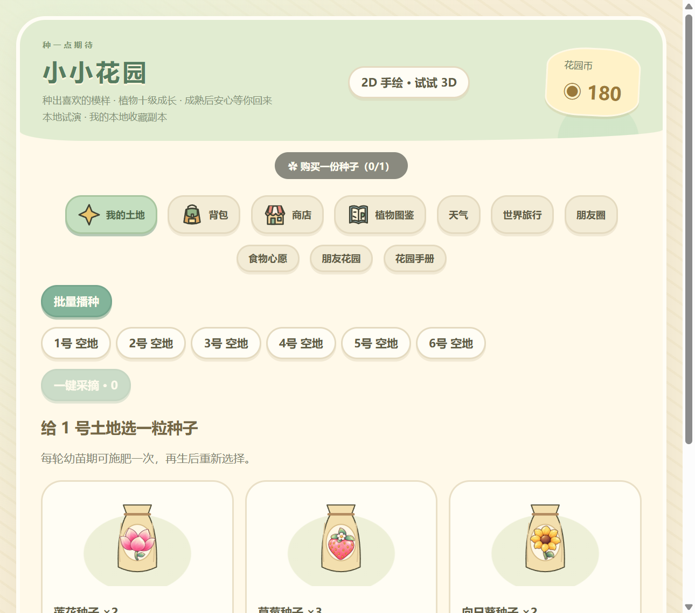
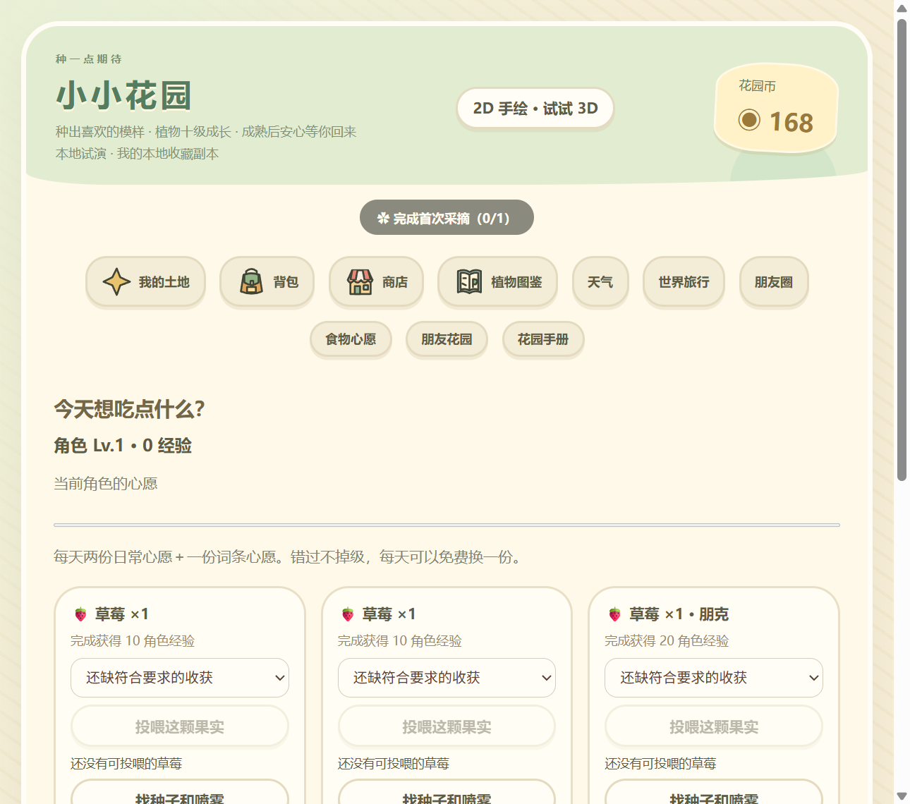
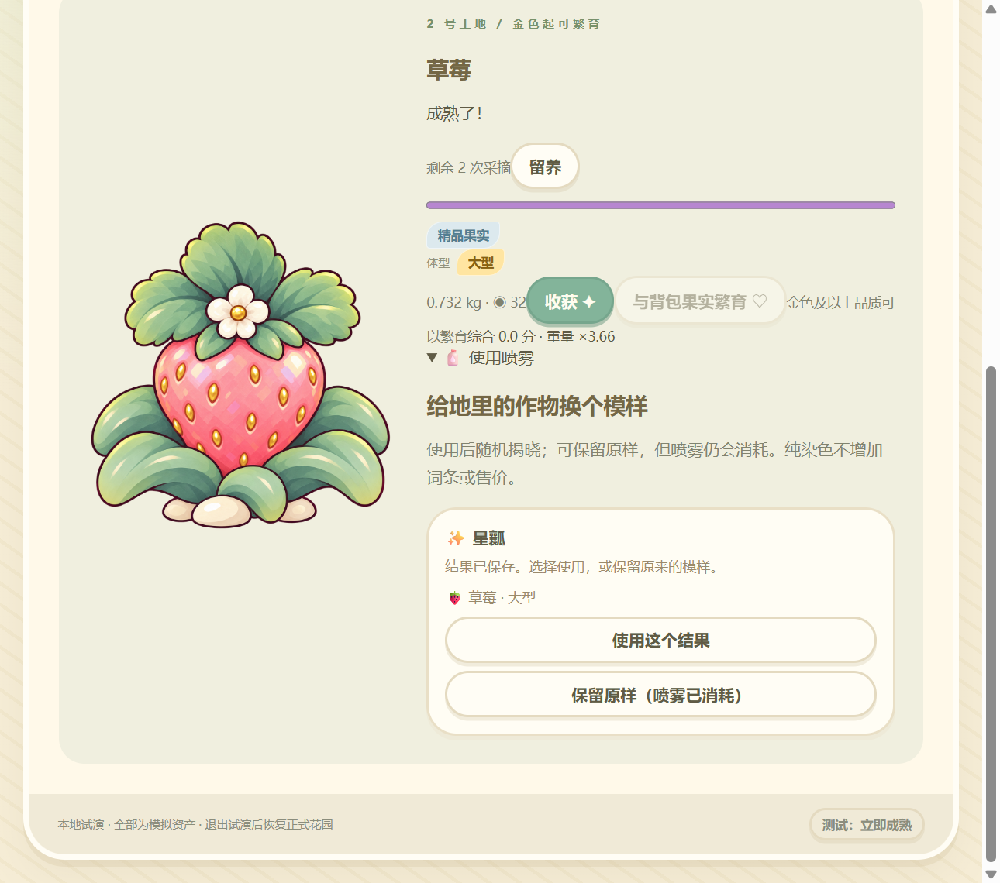
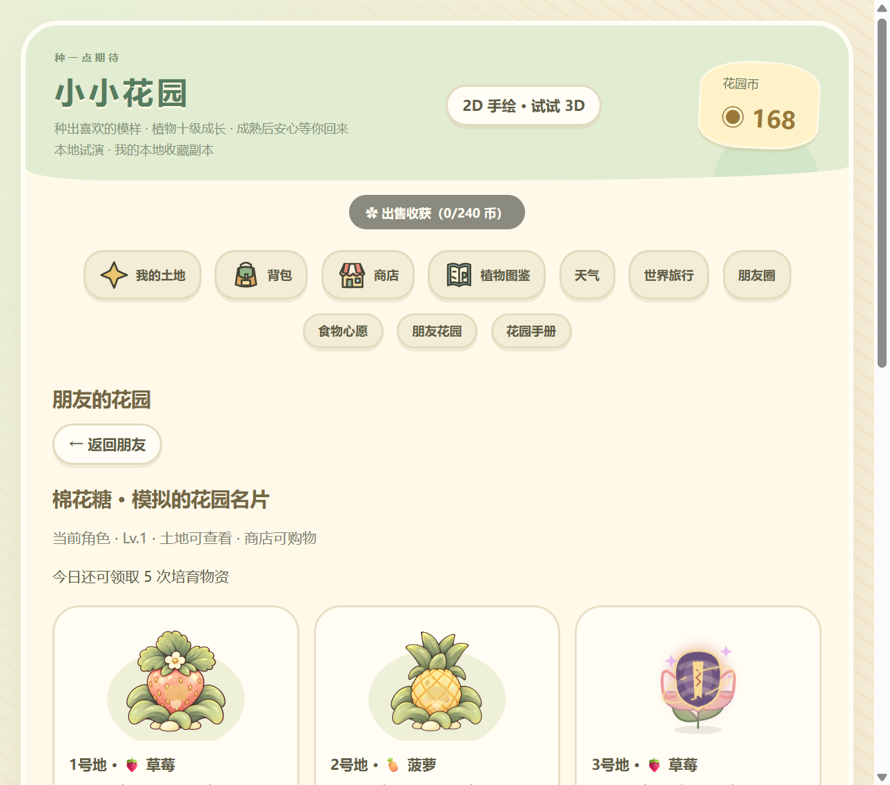
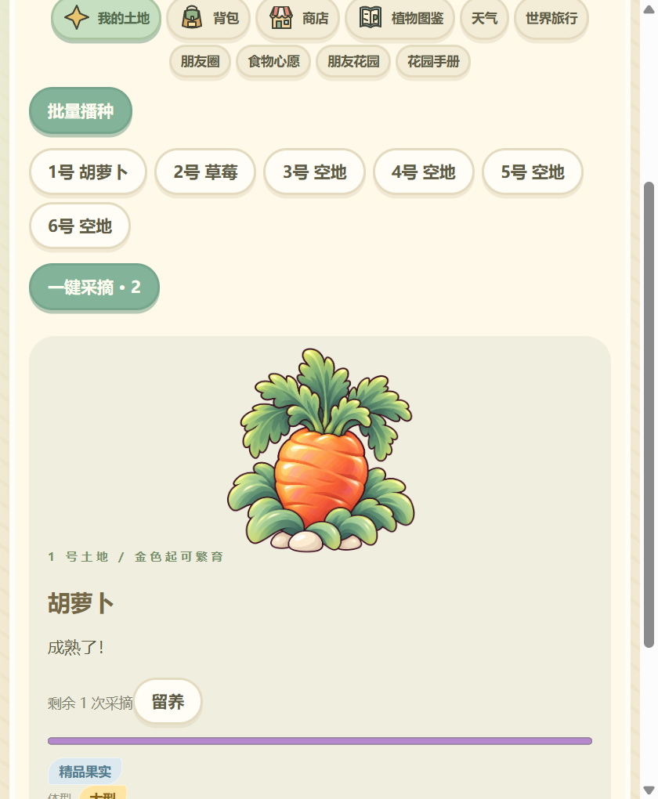
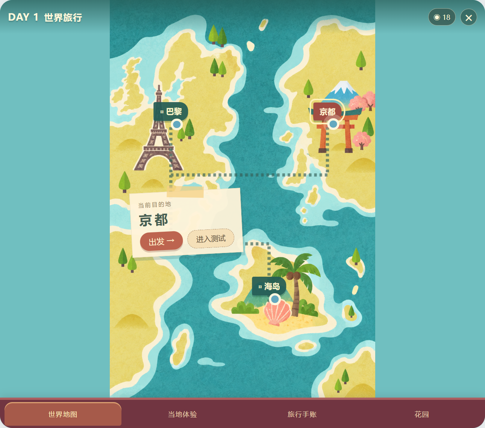

# QBot 养成体验与界面参考报告

2026-09-24 · 本轮仅实现重置入口，下述界面建议未实施。

## 我的判断

最有吸引力的是“养出一颗特别的果子，再拿它和角色、朋友发生关系”。成熟插画、田间喷雾、心愿和共同培育已经能支撑这个方向。当前主要问题是：**感情反馈藏在操作之后，规则和导航却占据最显眼的位置。** 玩起来容易先想着管理资源，再想到照顾桌宠。

视觉上也有同样的问题：每个功能几乎都被装进类似的圆角卡片、胶囊按钮和说明段落，页面缺少主次。只换字体、去掉渐变或增加纸纹，不会解决这种“模板感”。建议下一轮先做好“第一次种下 → 第一次收获 → 第一次投喂”这一条短流程，再统一美术。

## 这次实际体验了什么

使用当前构建的真实 Electron 花园界面与真实本地试演规则，从新手资源开始，通过页面按钮和选择框完成操作，逐步读取页面并检查截图。测试账号、对方角色和存档均隔离，未修改正式养成资产，也未向真实好友发送消息。

| 路线 | 实际结果 |
| --- | --- |
| 新档 → 点击新手任务 → 买胡萝卜 → 播种 | 花园币 180 → 168；任务依次推进到播种、采摘 |
| 查看心愿 → 种草莓 → 成熟 → 收获 | 收获弹窗出现；草莓保留两轮再生；任务转为出售收获 |
| 心愿页选果实 → 投喂 | 果实消耗，角色经验 0 → 10，心愿完成 |
| 朋友花园 → 共同培育 → 暂停 | 能进入虚拟朋友土地，操作入口切换为暂停/参与 |
| 朋友商店购买果实喷雾 → 田间使用 → 采用结果 | 花园币 168 → 18；本次随机获得星瓤，草莓成为金色、可繁育亲本 |
| 进入繁育 | 看到了精油、概率和配对条件；背包缺少金色亲本，未完成繁育 |
| 图鉴、旅行首页、560×680 窄窗 | 图鉴信息完整但很长；旅行地图更有场景感；抽查的窄窗页面无横向溢出 |

**体验边界：**成熟使用了试演的“立即成熟”，没有真实等待完整生长周期；原生投喂确认在隐藏测试窗中阻塞后，恢复模拟快照并以确认替身继续。窗口通过自动化点击实际控件，不能等同真人鼠标手感测试。没有验证长期留存、真实多人延迟、桌宠全套投喂表演、完整繁育产出或旅行全流程。测试时钟与真实界面时钟不完全同步，因此不据此评价倒计时准确性和合作在线人数。以下排序是这次体验后的设计判断，不是用户研究统计。

## 优先优化清单

| 优先级 | 观察到的问题与证据 | 建议 | 验收方式 |
| --- | --- | --- | --- |
| P1 | 860×760 花园初始页有十个主导航；标题、宣传句、余额和任务占据上半屏，种子操作落在下方。见图 A | 缩小固定页头；主要入口先保留花园、背包、小店、朋友，其余进入手册/更多；场景中直接点地块 | 同尺寸无需滚动即可看到一份种子的名称、成熟时间和播种按钮 |
| P1 | 新手任务先要求购买，而初始已有种子；我买了最便宜的胡萝卜，之后才发现心愿要草莓 | 首次目标由角色心愿驱动，优先使用已有草莓种子；购买作为缺种子时的分支 | 新用户能说清“为什么种它”，无需先打开商店再找心愿 |
| P1 | 首次收获后只提供“收好”，主任务立即变成出售 240 币；这与投喂争用同一果实 | 收获结果提供“喂给它”作为符合心愿时的主操作；标记心愿所需果实，出售前提示 | 可从收获结果直接完成一次投喂，批量卖出不会悄悄卖掉心愿预留果实 |
| P1 | 田间详情把重量、售价、收获、繁育和限制说明排在相邻行，860 宽截图出现生硬换行。见图 C | 主操作独立一行；说明移到对应按钮下；高级信息折叠 | 560/860 宽都没有按钮与说明挤在一起；一眼找到收获 |
| P1 | 喷雾结果只有词条名称和采用/保留按钮，缺乏新旧效果对比；花了 150 币后，价值感主要靠文字 | 并排展示当前/候选，标出变化槽、品质和心愿匹配；应用后短暂聚焦作物 | 不读规则也能判断“哪里变了、是否更想要”；保留原样的消耗说明仍清楚 |
| P2 | 繁育尚无第二亲本时，先看到 0/90、两种保底、精油、30%/25%/20% 等规则 | 先呈现两个亲本位置和缺失原因；满足条件后展开继承预览，详细概率放二级 | 缺亲本时首屏明确“还差什么、去哪里找”，而不是先学习整套算法 |
| P2 | 心愿页出现两张相同草莓需求，且一上来就列出到 Lv.10 约 55 天的估计。见图 B | 日常需求可合并为两份或赋予不同语境；优先显示最近的一个解锁预告 | 用户知道下一次互动奖励，并感到今天已有收获；天数预测放成长详情 |
| P2 | 朋友页先显示访问权限、领取次数等元信息，再展示土地；培育规则强调人数、秒数、概率 | 先见朋友角色和想帮忙的那株；用一个清晰的共同进度，规则放展开项 | 首屏能识别朋友、目标、自己的贡献与一个主操作 |
| P2 | 图鉴一次铺开大量未发现词条与来源；收集乐趣被资料密度稀释 | 做成标本册：已发现、近期可获得、远期剪影；点开才看来源/概率 | 首屏能找到一个近期目标；高级玩家仍能查询全部规则 |
| P2 | 新的朦胧果苞与封印形态是扁平矢量，成熟植物是细腻手绘，幼苗又是粗描边 | 下一轮统一边缘、明暗和笔触；中间形态保留物种的枝干/叶冠区别，遮住果实细节 | 同一物种三个阶段并排看像同一套资产；缩小后仍能区别品质 |
| P3 | 商店刷新显示类似“154:03”，新手会短暂猜测是分钟还是小时；概率词条和系统术语也偏多 | 长倒计时使用“2小时34分后”；把结果放前、计算依据后置 | 用户不用换算就能安排下一次回来 |

P1 应先于整体换肤；这次未发现足以据此定为数据丢失级 P0 的问题。

## 需要保留的优点

- 成熟植物原画有吸引力，尤其草莓和菠萝；应继续作为画面的主角。
- 幼苗、朦胧果苞、特殊封印、揭晓的方向成立，能拉开普通等待与稀有期待。
- 喷雾放在田间之后，“照料这株植物”的语义自然，比背包里加工果实更贴题。
- 商店的两个标签已经减少了入口割裂；种子标注成熟分钟数有用。
- 成熟后等待玩家回来、错过心愿不掉级，符合陪伴型产品的轻负担定位。
- 旅行地图已有场景、路线、地点和纸条，其表现方式比统一卡片列表更有辨识度。可以借用这种思路，但不必把花园也做成地图。

## 国外调研：怎样减少模板化的“AI 感”

“像 AI”是主观观感，不能靠某一种字体或配色断定。这里把它拆成可操作的问题：功能不分主次、所有页面套同一种布局、素材语言不一致、装饰不能说明状态。

NN/g 对真实项目的 AI 原型评估发现，明确的布局、品牌、组件及交互状态要求，以及具体设计参考，能改善输出；但层级、分组、留白和语境仍需要逐项判断。对本项目的启发是先给出一条有目的的用户路径和组件规则，而不是仅要求“温馨、可爱、不像 AI”。[NN/g 原文](https://www.nngroup.com/articles/ai-prototyping/)

### 可直接查看的界面参考

| 参考 | 重点看什么 | 对 QBot 的应用建议 | 不照搬什么 |
| --- | --- | --- | --- |
| [Animal Crossing：配方背包界面](https://interfaceingame.com/screenshots/animal-crossing-new-horizons-recipes-inventory/) · [成就界面](https://interfaceingame.com/screenshots/animal-crossing-new-horizons-achievements/) | 物品缩略图与选中详情的分工，功能由具体物件承载 | 种子袋网格＋一个选中详情；成长奖励用册页/印章形成收集感 | 不复制任天堂素材、角色或全部导航结构 |
| [Cozy Grove 官方介绍与画面](https://spryfox.com/our-games/cozy-grove/) | 手绘世界、轮廓语言、角色与环境关系 | 保留目前成熟植物的手绘温度；控制背景细节，让稀有作物更突出 | 不把密集场景细节搬到几十像素的桌面提示上 |
| [Unpacking 官方截图与无障碍说明](https://www.unpackinggame.com/) | 物件本身承担信息，动作与反馈直观 | 种子袋、篮子、喷壶、标本册各有用途；减少依赖说明文字 | 不为拟物强迫拖拽。官网明确提供无需拖拽/长按、可单手鼠标操作的方式 |
| [Playdate 官方设计指南](https://help.play.date/developer/designing-for-playdate/) | 小尺寸图形和文字可读性、真实尺寸验证 | 先以桌面实际大小验收果苞、品质和提示，别只看大图；少量有意义的特效 | 不直接照抄其黑白像素风或字体像素数；它是不同设备 |

Animal Crossing 的两个链接是截图资料库；另附[任天堂官方介绍](https://animalcrossing.nintendo.com/new-horizons/)供了解作品背景。上表的迁移建议是我的设计判断，并非原作者对 QBot 的建议。

下方为资料库提供的参考缩略图，点击上表链接可查看原页面；仅作设计研究，未加入游戏素材。

### 推荐方向：一本正在生长的园艺手账

花园页像正在照看的小苗圃，背包像收获篮，小店像种子摊，图鉴像标本册。它们可以共享颜色、字体、边框和交互规则，但不必都长成“标题＋三列卡片＋按钮”的样子。

1. **一种主体美术语言。** 延续成熟植物的手绘风，统一幼苗、果苞、喷雾瓶和图标。系统 emoji 不再承担关键物品识别。
2. **一个页面一个视觉主角。** 土地页是选中的作物，心愿页是角色，小店是货物；顶部标语和余额退居次要位置。
3. **颜色承担状态。** 奶油底、墨棕文字、叶绿操作，稀有品质色留给作物与品质标记。减少所有卡片都发光、所有按钮都厚重的竞争。
4. **装饰有原因。** 胶带用于贴住记录，印章表示已完成，金色封签表示待揭晓；不要随机歪斜和堆纸纹来伪装手工感。
5. **关键反馈有自己的节奏。** 普通收获短促，首次发现停留稍长，特殊培育有封签松动与揭晓停顿。具体时长应通过试玩确定；支持跳过与减少动态效果。
6. **中文阅读优先。** 正文字体稳定、字号和行距清晰，装饰字体只放短标题；数字、单位、按钮之间留出固定间距。

### 建议下一轮先做的三个设计稿

| 设计稿 | 必须解决的问题 | 评估标准 |
| --- | --- | --- |
| 新手土地页 | 为什么种、种哪里、多久成熟 | 首屏能播种，理解这颗果实对应谁的心愿 |
| 收获 → 投喂 | 收到果实后该做什么、角色如何回应 | 一条短路径完成投喂，同时保留出售/收藏选择 |
| 稀有培育与喷雾揭晓 | 等待是否值得、变化是否看得懂 | 显示前后差别和结果用途，不靠大段说明制造价值 |

设计稿先用真实中文、真实资源数量、空状态、缺亲本状态和长物品名填充；分别看 560×680 与 860×760，再做视觉润色。暂不建议一次重做所有页面。

## 本轮截图证据

### A · 新手花园

### B · 心愿页

### C · 田间喷雾结果

### D · 朋友花园

### E · 窄窗详情

### F · 已有旅行地图

## 已交付的重置入口

桌宠右键 → **养成从头开始…** → **备份并从头开始**。取消为默认选项。实现后需要重启当前旧桌宠实例才能看到新菜单；本轮没有替用户执行正式重置。

范围：本机花园、种子、收获物、花园币、图鉴、旅行和角色成长；本机积分、宝箱、家具库存与摆放。恢复新手起始资源。保留角色素材、聊天、记忆、好友和其他设置；联机数据不清除，重启后选择本地花园。

备份在应用数据目录 `progress-reset-backups/<唯一编号>/originals.json`，保留原始文件内容及普通轮换备份。重置在正常退出后、下次启动加载任何存档前执行；中途失败保留原始备份和计划，下次启动继续，不启动半重置的游戏。恢复旧档应先完全退出桌宠，再按 originals.json 的文件名恢复对应内容，不要在运行中覆盖。

验证：类型检查、正式构建通过；7 项自动测试覆盖默认取消、确认后正常重启、请求写入失败、原文备份、资产与旧备份重置、保留身份设置、失败前不改存档和中断续做。未在正式用户数据上执行重置。
