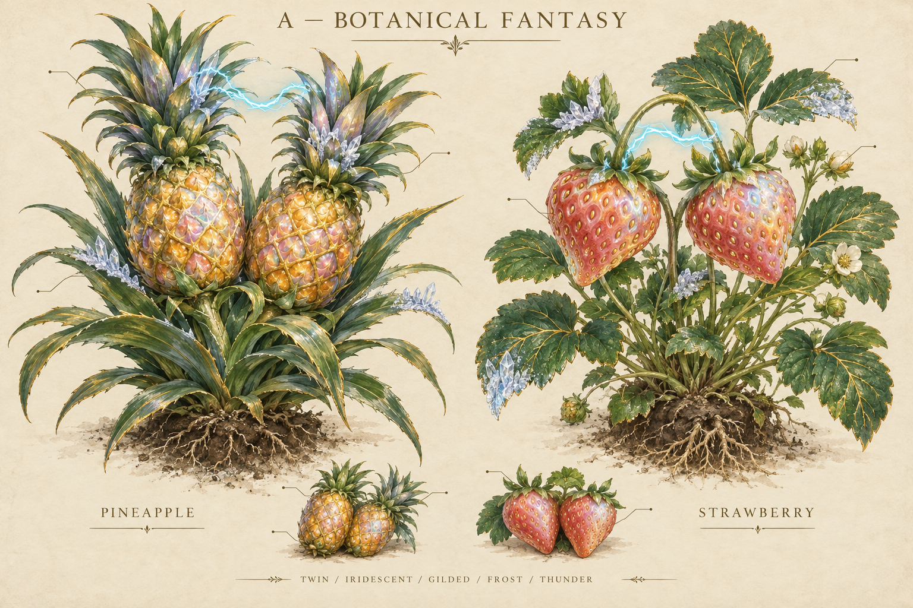
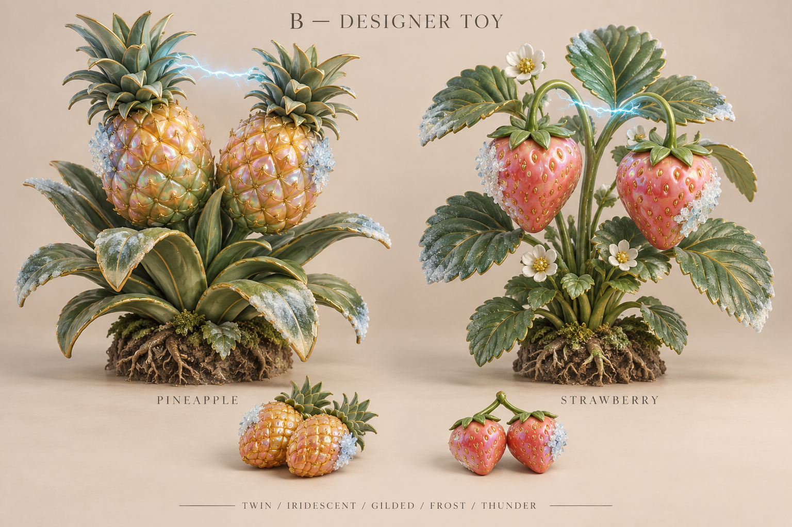
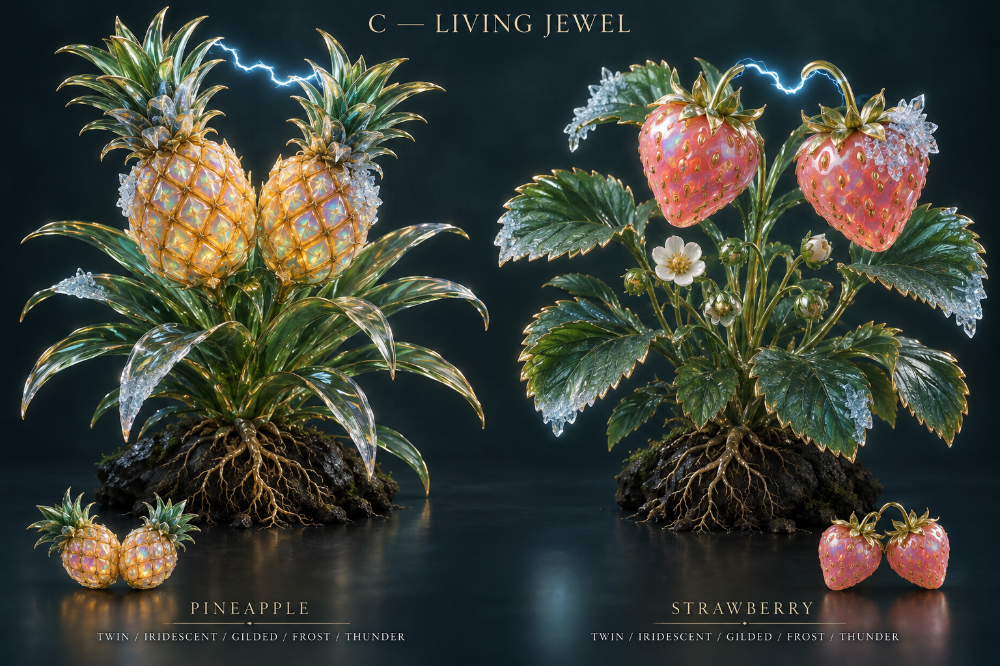
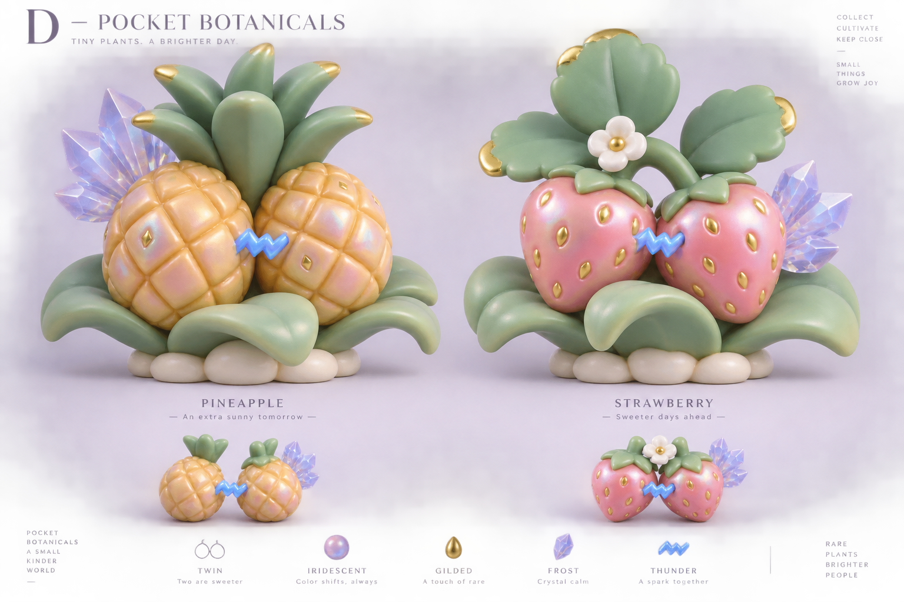

# 植物收藏美术调研与满配概念图
日期：2026-09-19。状态：探索提案，尚未批准为生产美术规范。

本轮目标：让成熟植物和收获果实本身值得珍惜、展示；用菠萝与草莓的五词条完成态倒推造型、材质、组合规则和技术路线。交付四张双物种方案板，共八个满配植株设计，每张包含收获果实小样。全部使用内置 image_gen 生成。没有修改游戏代码、经济概率或现有资产映射。

## 1. 当前落差与香蕉核查

当前 app/src/shared/garden.ts 的 SPECIES 为九种植物，没有 banana；在 docs、app/src、scripts 以及仓库可搜索的隐藏文件路径中，没有发现香蕉命名的素材或接入记录。这能确认当前正式物种入口没有香蕉，不能证明过去的外部生图或其他任务测试不存在。

app/src/renderer/garden/botanical-art.ts 中，菠萝和草莓目前是简化 SVG 形状，成熟植株通过同一个果实图形重复组合；legacy PNG 仅用于莲花和向日葵。虽然 assets/strawberry.png 仍存在，当前该函数未使用它。main.ts 的 art() 负责调色、双生复制和附件；mutation-effects.ts 添加虹彩、鎏金、冰纹、电弧等层。说明中“全部透明手绘 PNG”的历史表述不能代表现在所有物种。

判断：目前稀有性主要存在于属性和后期效果中，较少改变对象的雕塑轮廓、构造和真实材质关系。这是本轮优先改造的方向；不据此声称已完成实际用户体验验证。

## 2. NFT 参考：观察与可迁移判断

以下资料以项目方、创作者或官方文档为主；借鉴艺术组织方式，不把市场价格或稀缺数字当作品质证据。艺术方向与因果判断为本次设计推论。

| 参考 | 一手资料中的事实 | 对本项目的启发 | 不直接照搬 |
| --- | --- | --- | --- |
| CryptoPunks | 24×24 像素人物，类型和帽子、头饰等可辨属性形成收藏分类，作者明确谈到低分辨率识别 | 每个稀有属性都应有能被叫出名字的可见特征，缩小仍能认出 | 无需复刻像素画，更不需要只靠编号制造价值 |
| Murakami.Flowers | 同一花卉母题，颜色与背景形成系列；从种子到揭晓花朵 | 植物物种先有稳定母版，变异围绕母版变化；成长与揭晓形成期待 | 不照搬笑脸花或作品图案；这些是该项目已有的艺术身份 |
| Pudgy Penguins | 官方强调粗轮廓、丰满体态与创意属性，并扩展实体玩具 | 先建立想摸、想摆在桌面的外形，再附加稀有特征 | 不需要把植物都拟人化或戴帽子 |
| Doodles | 当前官方站展示 Toy Factory 和多种艺术玩具 | 从图片到可把玩的物件，是值得验证的收藏体验方向 | 当前官网不是完整历史 NFT 图鉴；不能用今天的玩具业务倒推早期商业成功原因 |
| Meebits | 生成式体素雕塑、可导出 3D 文件；作者明确指出 3D 配件需遵循空间连接规则 | 词条不只是一组贴图，还需要接口、空间占位和遮挡规则 | 不为 3D 而变成方块风；3D 本身不保证更美 |
| Clone X / RTFKT | 官方制作文档强调模块化、LOD、纹理、绑定与 GLB/FBX 资产 | 物种母模型＋材质变体＋几何附件能形成可持续生产资产 | 高级 NFT 头像效果不是一次自动建模就可复现的制作质量 |
| Cool Cats | 官网把同一收藏角色连到 3D 化身和多种游戏空间 | 藏品可出现在桌面、展架、合照中，身份保持一致 | 可用场景多不等于用户自然会珍惜，仍需验证 |

一手来源：
- CryptoPunks：https://www.larvalabs.com/cryptopunks
- Murakami.Flowers：https://murakamiflowers.kaikaikiki.com/
- Pudgy Penguins：https://media.pudgypenguins.com/education-posts/who-are-pudgy-penguins
- Doodles：https://www.doodles.app/
- Meebits：https://www.larvalabs.com/meebits
- Clone X / RTFKT：https://creators.rtfkt.com/feature-articles/3d-files-2-0
- Cool Cats：https://coolcats.com/

归纳为待验证的设计假设：可爱或美感使人想拥有；清晰差异使人愿意挑选；稳定身份和共同经历使人不舍得出售；合适的展示空间使人愿意炫耀。四件事都需要产品体验配合，不能只靠多加粒子。

## 3. 四套满配方案

共同五词条：双生、虹彩、鎏金、冰冻、雷击。均来自现有词条表，组合用作美术压力测试，不表示普通种子会频繁产出，也不新增抽取规则。此处“双生”探索两枚主果实共株，而当前实现是图像复制，正式采用将涉及表现语义调整。

### A 精绘植物标本

优势：自然生长感、图鉴收藏感、枝叶和根系故事性强。
缺点：轮廓碎，细金线与冰晶缩小易丢；植物更像画册里的珍稀标本。
适合：手账、大图鉴、成熟揭晓的静态主图；不优先作为桌面微缩主体。

### B 瓷器植物藏品

优势：材质和体积明确，像实物收藏。
缺点：生成结果比预期潮玩更写实，偏家居瓷器摆件；与 A 的轮廓差异不够大。
适合：中间对照，用于确认用户是否喜欢“真实植物转成工艺品”。

### C 琉璃宝石植物

优势：内部光泽、局部金属和冰晶能让高阶品质直接可见，最有展柜藏品感。
缺点：枝叶细密、深底和灯光对观感贡献很大；整株玻璃可能显得冷、易碎，种植生命感下降。
适合：最高阶变异的材质参考、收藏详情大图。不能把概念渲染的光学效果直接当实时效果承诺。

### D 口袋植物潮玩

优势：果实占比大，厚叶片、短枝干、大色块，整体亲切可把玩；轮廓最适合继续做小尺寸验证。
缺点：电弧变成了实体闪电符号，冰晶也接近装饰宝石；若采用需改回短促活电弧和更明确的冰冻边缘。标题和页脚对比度偏低，属于方案板排版缺陷，不应复用于 UI。
适合：主美术路线候选。构型仍是概念造型，尤其菠萝双生应在建模时补足共享茎与两枚果冠连接关系。

建议继续探索 D 的造型＋C 的局部材质。不要直接混用两张图；应在同一个 D 母模型上制作普通、稀有和满配三个状态。是否更值得珍惜仍需用户看图和实际尺寸体验验证。

## 4. 倒推词条的视觉语法

| 层级 | 本轮词条 | 负责的可见变化 | 组合规则建议 |
| --- | --- | --- | --- |
| 结构 | 双生；后续可含巨大化 | 分叉、果实数量、比例或生长轮廓 | 必须改变剪影，保留物种识别 |
| 主体材质 | 虹彩 | 果实表面随角度变色的珠光；菠萝保留蜜黄、草莓保留莓红线索 | 一种主材质占主体，避免多种全局颜色互相覆盖 |
| 局部工艺 | 鎏金 | 菠萝鳞片接缝、草莓种子、少量叶缘 | 建议视觉覆盖约 10%～15%，不把全株染黄 |
| 附生结构 | 冰冻 | 局部冻壳、透明冰簇、少量霜边 | 有专用空间，避免遮主果形 |
| 环境动态 | 雷击 | 两枚果实之间的间歇细电弧 | 强弱有节奏，暂停动画仍能辨认本体 |

“满配”是每个词条都成立，不要求每个区域都发光。未来已有紫色、薄荷、珊瑚等共存组合需要明确色彩优先级和局部分区，表现规则不能擅自删除已拥有的数值词条。

普通版也必须有好轮廓、好比例和可爱的成熟果实。稀有版主要提高结构、工艺和光学表现，避免普通版像劣质占位图。最终视觉由物种、基因、外观种子和美术版本稳定决定；重开或截分享图不能改变同一株的身份。外观种子/版本是建议新增的表达数据，当前未实现。

## 5. 三种生产与运行方式

| 路线 | 获得什么 | 主要代价 | 适用判断 |
| --- | --- | --- | --- |
| 精绘 2D 分层资产 | 绘画质感强；可沿用现有显示框架 | 每种结构组合需画、遮罩与遮挡约定，真正转动困难 | A 为主方向时适合 |
| 3D 制作，预渲染桌面＋详情实时 3D | 同一模型复用缩略图、展示图、转台；桌面渲染开销可控 | 要管理渲染缓存、图与模型一致性；预渲染不能穷举所有组合 | 当前首选验证方向 |
| 全部实时 3D | 角度、光照、结构词条实时响应，适合未来空间展览 | 透明窗、材质、阴影、组合遮挡、资源释放和低配性能要一起解决 | 需要实际常驻性能证据后再扩大 |

项目已依赖 Three.js 0.180.0，并有 cozy3d 实际几何样板；这说明存在技术基础，不表示植物管线已具备。

Three.js 的 MeshPhysicalMaterial 支持虹彩、清漆和透射，GLTFLoader 支持相应 glTF 扩展。官方同时明确高级物理材质每像素更贵，应按需要开启并配置环境贴图。当前在线文档可能晚于本项目锁定版本，实施时需再核对 0.180.0 对应属性。
- https://threejs.org/docs/pages/MeshPhysicalMaterial.html
- https://threejs.org/docs/pages/GLTFLoader.html

建议生产管线：菠萝/草莓母模型 → 独立果实/叶片/主茎材质区 → 双生几何变体与附件挂点 → 稳定组合参数 → 桌面缓存图、收获果实图、详情实时模型共同使用。轻量预渲染只缓存出现过的个体；不要预生成所有词条组合。桌面背景不受应用控制，透射材质不应假定能真实折射操作系统壁纸。

AI 图片负责定方向；图转 3D 可以尝试做草模，但还需检查背面、拓扑、叶片厚度、UV、材质区、附件连接与各角度轮廓。不把单张漂亮图片承诺为生产级模型。

## 6. 建议下一轮的最小验证

1. 选定轮廓路线后，两物种各制作普通态、代表性单词条态、五词条态，保持同一个母体设计。
2. 同屏观察 64/96/160px 的物种识别、主词条识别，以及浅色/深色/花纹桌面背景。此轮尚未执行该缩放与真实桌面验收。
3. 为一株草莓做真实可旋转样板，验证材质随着视角变化、双生结构、冰晶遮挡、去掉特效后的形状吸引力。
4. 只用真实拥有的收获记录配合收藏展示：命名、收获日期、亲本/培育经历（有真实记录才显示）、桌面陈列和合照。若显示“唯一/前百分之几”等统计，必须有可信统计范围，不能从概念图编造。
5. 先验收一株、六株同屏和详情单株，再判断是否需要全部实时 3D；记录空闲 CPU/GPU、内存、帧率、隐藏暂停/恢复。数值预算应依据目标硬件制定。
6. 原有香蕉测试若找到，应连同原始提示词、词条定义、素材路径和实际消费入口建立映射，避免再次出现“测试图存在但游戏仍用占位图”。

完成边界：本轮完成资料核查、四套生成图、逐图美术评审与路线建议；未做真实 3D 建模、实时植物样板、游戏接入、小尺寸实测或玩家偏好测试。方案板文字不作为可用 UI 文案。所有完整生图提示词见 prompts.md。

